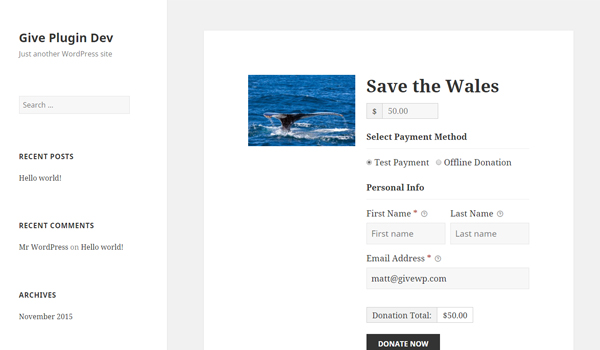

# Give 2015
A child theme for Twenty Fifteen which highlights how to theme Give.

## Before and After

Here is Give's native styles on the single Give form with Twenty Fifteen out of the box.

**SINGLE FORM BEFORE**

It works, but it's not necessarily the best presentation. Because of Twenty Fifteen's unique sidebar and narrow content area the Give Sidebar makes the form area pretty squished. 

You can disable the single Give sidebar globally by going to "Donations > Settings" then the "Display Options" tab and checking "Disable single form sidebar". But the featured image is contained within the Sidebar, so doing that results in a fairly boring heading to your very important donation page.

Instead, read up on [Themeing with Give](https://givewp.com/documentation/developers/themeing-with-give/) and you can get a Twenty Fifteen page more like this:

**SINGLE FORM AFTER**

Next you'll want to pay attention to your Give Archive page. Out of the box it also is not optimal:

**GIVE ARCHIVE BEFORE**

Give supports `the_title()`, `the_excerpt()`, and `the_post_thumbnail()` which is really all you need to make a striking landing page for all your donation forms like this:

**GIVE ARCHIVE AFTER**

## Anatomy of Give 2015

There is much more you can do to customize the look/feel of your Give pages and shortcodes, so this is just a start. All of this was achieved with just a couple files:

* `give-2015/`
  *   `give/` this folder holds all the template files that can over-write the native Give      plugin template files
      * `/single-give-form/` -- this folder holds several template files relevant to just the single Give form.
          * `content-single-give-form.php` -- this is the main template file for the Give form content. 
  * `inc/` -- folder for holding functions
      * `give-functions.php` this file helps add some custom Give classes so that the content is forced to full width.
  *  `give.php` is the master single Give form template file that's should be in your theme's Root folder.

All other files are relevant for general child-themeing.

## About WordImpress

We build impressive Plugins for your WordPress website. Find out more about us and read more great tutorials at [https://wordimpress.com](https://wordimpress.com)

**HERE'S TO BUILDING THE WEB!**

